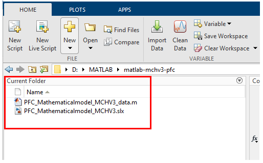
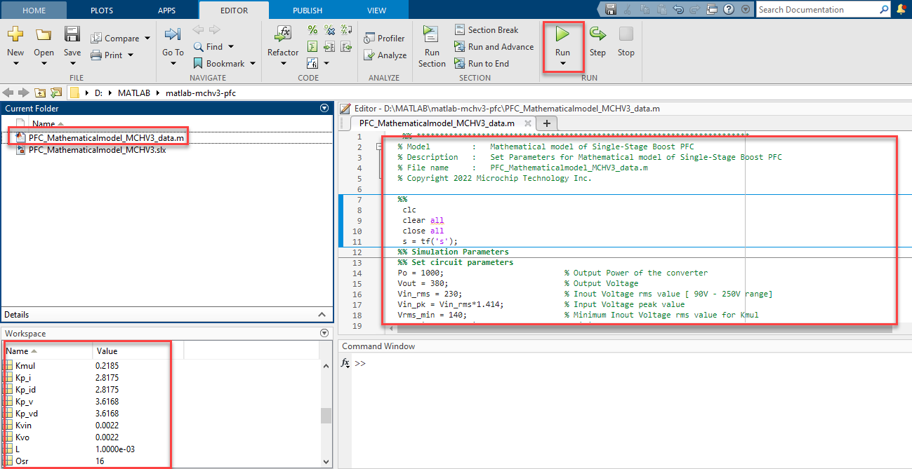
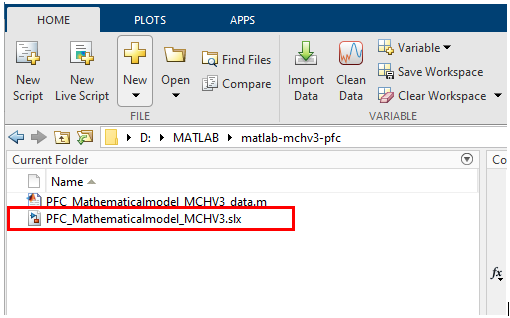
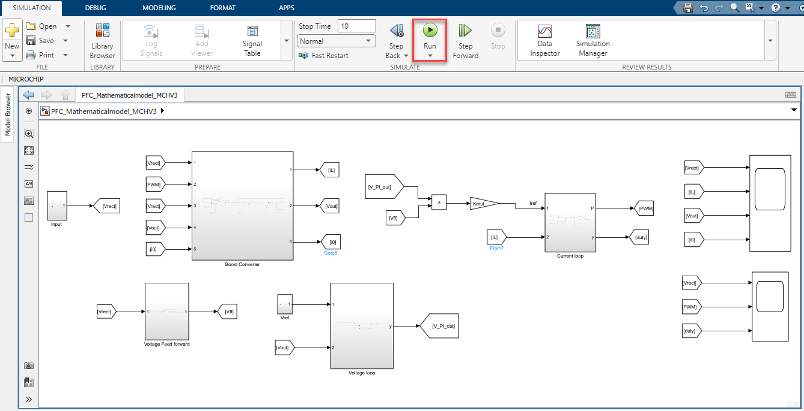
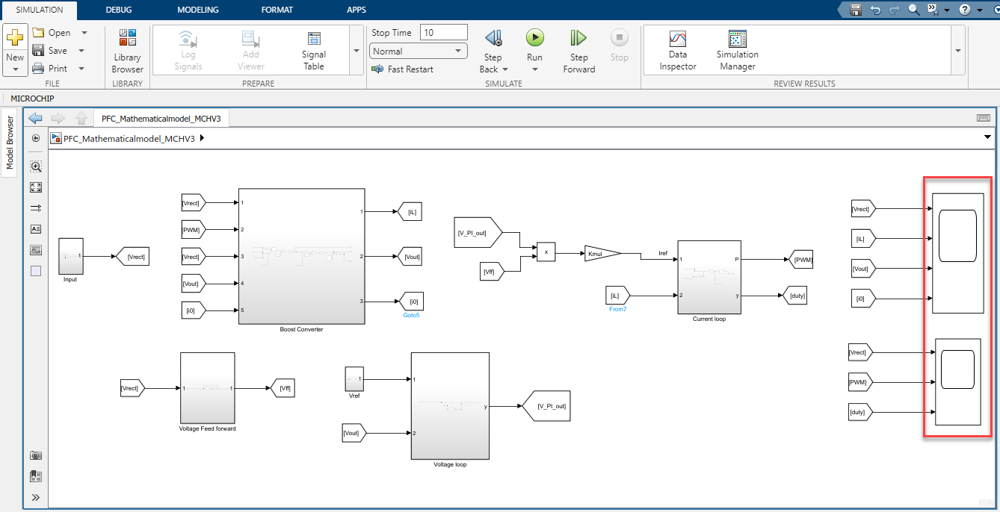
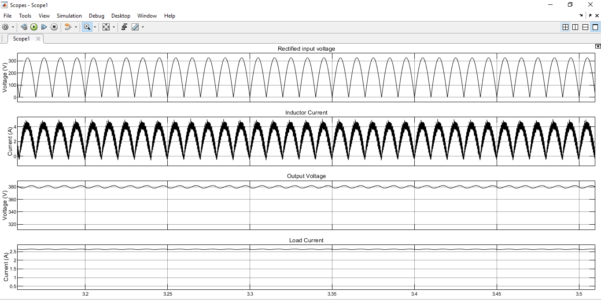
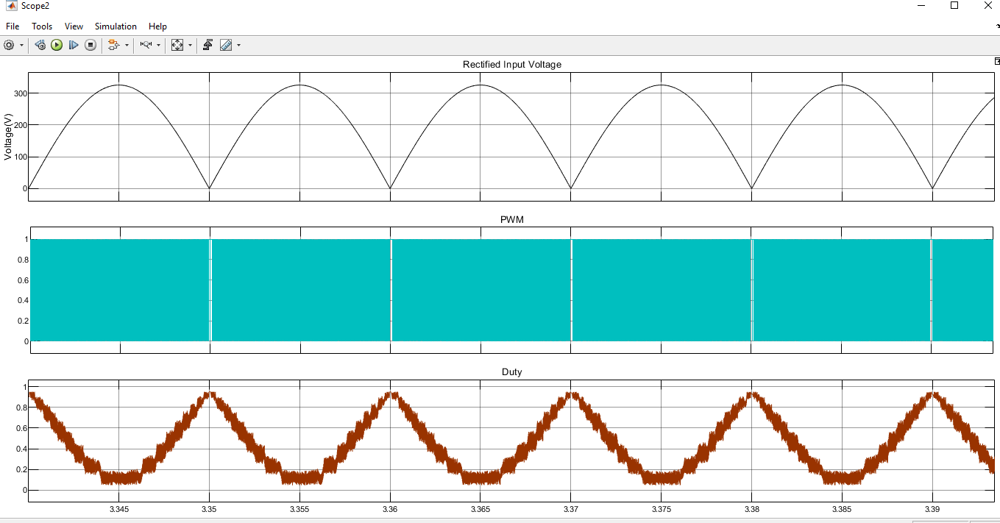
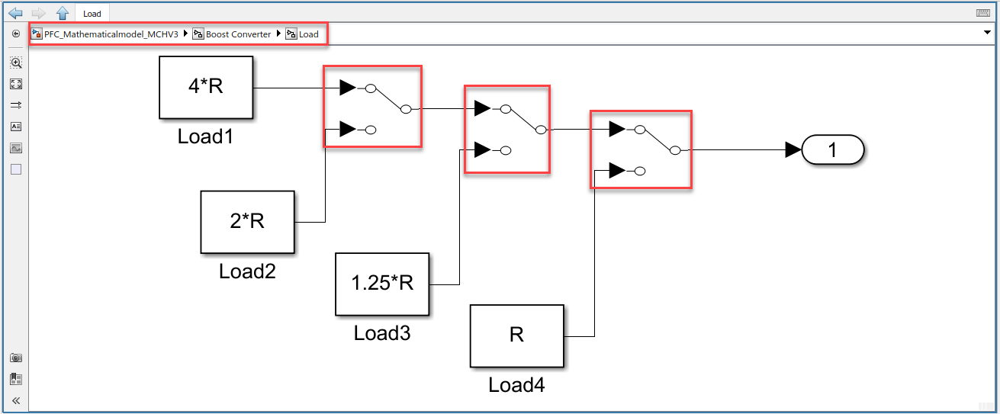
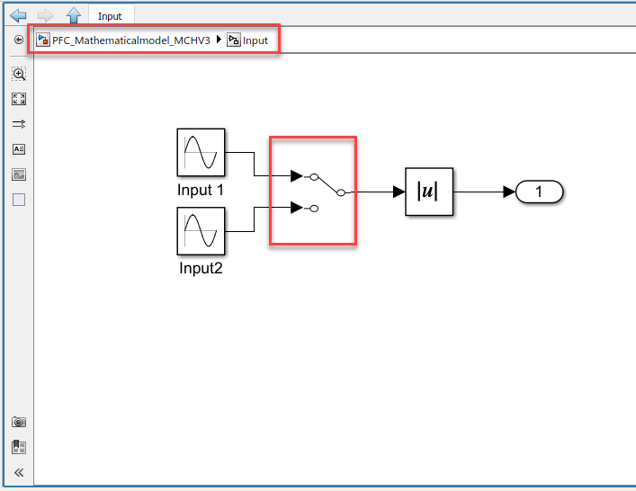

 
# MATLAB-Simulink model of Single-Stage Boost Power Factor Correction Converter

## 1. INTRODUCTION
This document describes how to configure and run the MATLAB-Simulink model of Single-Stage Boost Power Factor Correction Converter.

The Microchip dsPICDEM™ MCHV-3 Development Board [DM330023-3](https://www.microchip.com/en-us/development-tool/dm330023-3) includes a front-end Single-Stage Boost Power Factor Correction Unit and a High-Voltage Three-Phase Motor Control Inverter.
By default, the model is configured to simulate the Power Correction Converter in the  dsPICDEM™ MCHV-3 Development Board.

## 2.	SUGGESTED DEMONSTRATION REQUIREMENTS
### 2.1 MATLAB Model Required for the Demonstration
-  MATLAB model can be cloned or downloaded as zip file from the Github repository ([link](https://github.com/microchip-pic-avr-solutions/matlab-mchv3-pfc)).

### 2.2	Software Tools Required for the Demonstration
1.	MATLAB R2022a

## 3.	BASIC DEMONSTRATION
Follow the below instructions step-by-step, to set up and run the MATLAB and Simulink model of power factor correction converter

1. Launch MATLAB R2022a 
2. Open the folder downloaded from the [Github repository](https://github.com/microchip-pic-avr-solutions/matlab-mchv3-pfc)

    

    

3. Double-click and open the **PFC_Mathematicalmodel_MCHV3_data.m** file from the folder. This **.m file** contains the configuration parameters required for running the model. Execute the file by clicking the **Run** icon and wait until all the variables are loaded in the **Workspace** tab.

    

      

4. Double click on the **PFC_Mathematicalmodel_MCHV3.slx** from the folder to open the Simulink model.

    

      

5. This opens the Simulink model as shown below. Click on the **Run** icon to start the simulation.

    

      

6. Double click on the **Scope** to view the input and output signals in the system.

    

      

    Example plots are shown below:
    

       

    

         

7. **Variable load** subsystem can be used to test the model under different load conditions to check the dynamic performance.

    

      

8. **Input subsystem** is provided with two input sources ,and it can be used to vary the applied input voltage to the model.
    

      